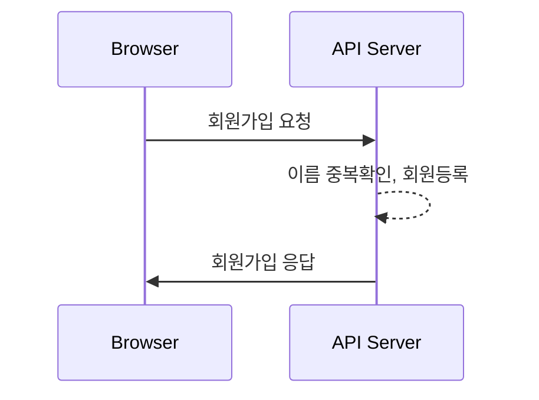
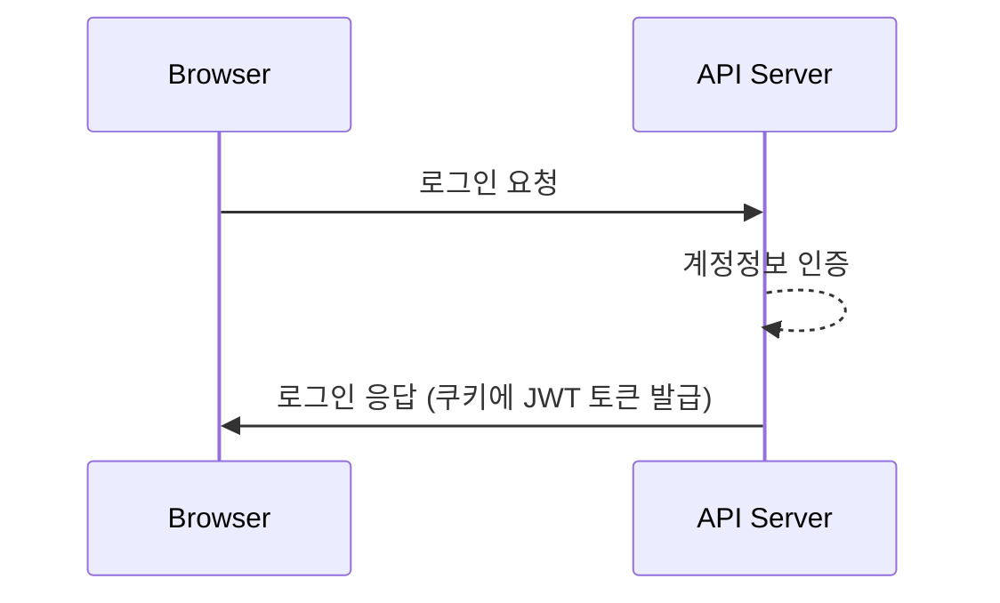
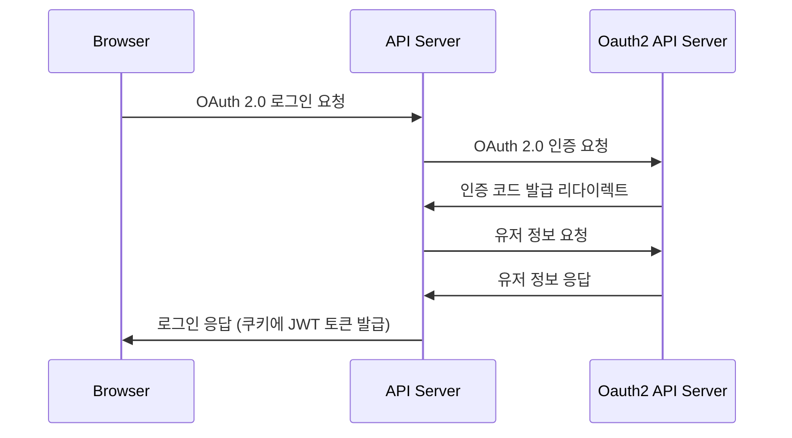
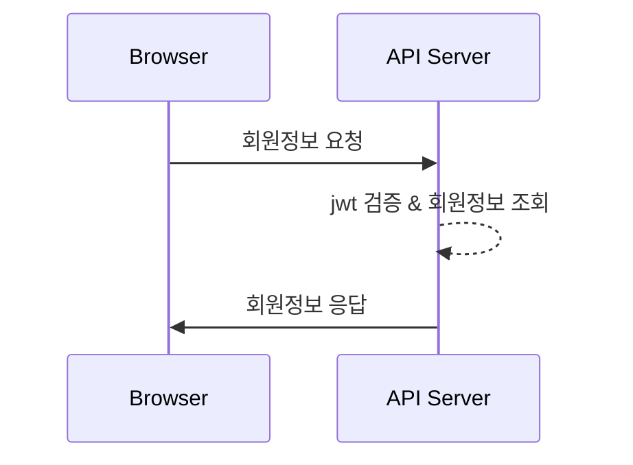

# 🔐 auth-tutorial
웹 브라우저에서 인증/인가 방식 학습을 위한 튜토리얼 코드입니다.

<br>

### 사용 기술

 <br>


 <br>


<br><br>

## 🚀 Sequence Diagram

### ```회원가입```

<br>

### ```로그인```


<br>

### ```OAuth 2.0 로그인```


<br>

### ```회원정보 조회```



<br><br>

## 🌁 Browser Client

### Login Page
- 로그인 요청
- 회원가입 페이지 이동

### Join Page
- 회원가입 요청

### Main Page
- 로그아웃 요청
- 회원정보 요청

### OAuth2Callback Page
- 서버측에서 OAuth2 로그인 성공 리다이렉트
- jwt를 쿠키 형태로 전달


<br><br>

## 📄 Backend API


| 기능 | Method | URL | 
|---|---|---|
| 회원가입 | POST | /api/v1/users |
| 로그인 | POST | /api/v1/auth/login |
| 로그아웃 | POST | /api/v1/auth/logout |
| 본인 아이디 조회 | GET | /api/v1/auth/whoami |
| 회원정보 요청 | GET | /api/v1/users/{userId} |

<br>

**회원가입 - [POST] ```/api/v1/users```**
- 요청<br>
  ```json
  HTTP Body
  {
    "name" : string,
    "password" : string
  }
  ```
- 응답<br>
  ```json
  HTTP Body
  {
    "status": 201,
    "message": "Join completed.",
    "data": null,
    "timestamp": "yyyy-mm-ddThh:mm:ssZ"
  }
  ```
  ```json
  HTTP Body
  {
    "status": 400,
    "message": "Invalid value",
    "data": null,
    "timestamp": "yyyy-mm-ddThh:mm:ssZ"
  }
  ```
  ```json
  HTTP Body
  {
    "status": 409,
    "message": "Duplicated name",
    "data": null,
    "timestamp": "yyyy-mm-ddThh:mm:ssZ"
  }
  ```
  ```json
  HTTP Body
  {
    "status": 500,
    "message": "Server error",
    "data": null,
    "timestamp": "yyyy-mm-ddThh:mm:ssZ"
  }
  ```

<br>

**로그인 - [POST] ```/api/v1/auth/login```**
- 요청
  ```json
  HTTP Body
  {
    "name" : string,
    "password" : string
  }
  ```
- 응답
  ```json
  Cookie
  "Authorization": "Bearer {JWT}"

  HTTP Body
  {
    "status": 200,
    "message": "Login completed successfully.",
    "data": null,
    "timestamp": "yyyy-mm-ddThh:mm:ssZ"
  }
  ```
  ```json
  HTTP Body
  {
    "status": 401,
    "message": "Authentication failed.",
    "data": null,
    "timestamp": "yyyy-mm-ddThh:mm:ssZ"
  }
  ```
  ```json
  HTTP Body
  {
    "status": 500,
    "message": "Server error",
    "data": null,
    "timestamp": "yyyy-mm-ddThh:mm:ssZ"
  }
  ```

<br>

**로그아웃 - [POST] ```/api/v1/auth/logout```**
- 요청<br>
  ```json
  Cookie
  "Authorization": "Bearer {JWT}"
  ```
- 응답
  ```json
  HTTP Body
  {
    "status": 200,
    "message": "Logout completed successfully",
    "data": null,
    "timestamp": "yyyy-mm-ddThh:mm:ssZ"
  }
  ```
  ```json
  HTTP Body
  {
    "status": 401,
    "message": "Authentication failed",
    "data": null,
    "timestamp": "yyyy-mm-ddThh:mm:ssZ"
  }
  ```
  ```json
  HTTP Body
  {
    "status": 500,
    "message": "Server error",
    "data": null,
    "timestamp": "yyyy-mm-ddThh:mm:ssZ"
  }
  ```

<br>

**본인 아이디 조회 - [GET] ```/api/v1/auth/whoami```**
- 요청
  ```json
  Cookie
  "Authorization": "Bearer {JWT}"
  ```
- 응답
  ```json
  {
    "status": 200,
    "message": "OK",
    "data": {
      "userId": number
    },
    "timestamp": "yyyy-mm-ddThh:mm:ssZ"
  } 
  ```
  ```json
  {
    "status": 401,
    "message": "Authentication failed.",
    "data": null,
    "timestamp": "yyyy-mm-ddThh:mm:ssZ"
  } 
  ```
  ```json
  {
    "status": 500,
    "message": "Server error",
    "data": null,
    "timestamp": "yyyy-mm-ddThh:mm:ssZ"
  } 
  ```

<br>

**회원정보 조회 - [GET] ```/api/v1/users/{userId}```**
- 요청
  ```json
  Cookie
  "Authorization": "Bearer {JWT}"
  ```
- 응답
  ```json
  {
    "status": 200,
    "message": "OK",
    "data": {
      "id": number,
      "name": string,
      "provider": string,
    },
    "timestamp": "yyyy-mm-ddThh:mm:ssZ"
  } 
  ```
  ```json
  {
    "status": 401,
    "message": "Authentication failed.",
    "data": null,
    "timestamp": "yyyy-mm-ddThh:mm:ssZ"
  } 
  ```
  ```json
  {
    "status": 404,
    "message": "User with [id] not found.",
    "data": null,
    "timestamp": "yyyy-mm-ddThh:mm:ssZ"
  } 
  ```
  ```json
  {
    "status": 500,
    "message": "Server error",
    "data": null,
    "timestamp": "yyyy-mm-ddThh:mm:ssZ"
  } 
  ```

  <br><br>

## 🔎 Details

**일반 로그인**
1. 일반 로그인 요청
2. 등록한 시큐리티 설정 클래스에서, ```UsernamePasswordAuthenticationFilter```를 상속받은 ```LoginFilter```에 설정한 URL로 인해 ```LoginFilter.attemptAuthentication()``` 호출
    1. 요청 바디에 있는 이름과 비밀빈호 -> ```UsernamePasswordAuthenticationToken``` 생성
    2. 생성한 인증 토큰 인자로 전달받는 ```AuthenticationManager.authenticate()``` 호출
3. ```UserDetailsService``` 를 구현한 클래스에서 ```loadUserByUsername()``` 호출하여 실제 유저 로딩하고 내부적으로 인증 시도
4. ```LoginFilter```에서 결과 응답
    - 인증에 성공한다면, ```successfulAuthentication()``` 호출하여 jwt 담은 쿠키 응답
    - 인증에 실패한다면, ```unsuccessfulAuthentication()``` 호출하여 실패 응답

<br> 

**OAuth2 로그인**
1. 스프링 시큐리티가 제공하는 소셜 로그인 인증 페이지 요청 
    - ```http(s)://{BACKEND IP:PORT}/oauth2/authorization/{서비스명}/{client_id}/{redirect_url}```
2. 소셜 로그인 요청
3. 소셜 로그인 인증 서버에서 로그인 성공 리다이렉트 처리
    - 소셜 로그인 서비스 등록과 스프링 부트 설정 파일에 작성한 리다이렉트 url로 처리 진행
    - ```http://{BACKEND IP:PORT}/login/oauth2/code/{서비스명}``` -> 관례적인 URL 네이밍
4. 리다이렉트로 들어온 code를 사용하여 ```OAuth2AuthorizationRequestRedirectFilter```와 ```OAuth2LoginAuthenticationFilter```를 통해 소셜 로그인 인증 서버에게 access 토큰 요청
5. ```OAuth2LoginAuthenticationProvider``` 를 통해, 받은 access 토큰으로 소셜 로그인 리소스 서버로부터 유저 정보 획득
6. ```DefaultOAuth2UserService```를 상속한 ```CustomOAuth2UserService``` 클래스에서 ```loadUser()``` 호출하여 해당 유저 정보 로딩
7. 등록한 ```OAuth2LoginSuccessHandler``` 를 통해 인증 성공 처리
    - jwt 인증 쿠키 응답
    - 하이퍼 링크로 요청했기 때문에 따로 해당 소셜 로그인 탭을 임의로 닫거나 응답을 조회할 수 없으므로 쿠키 방식으로 전달한 것이고, 해당 탭을 컨트롤하기 위해 콜백용 컴포넌트를 만들고 리다이렉트 시킴으로써 소셜 로그인 완료 후 탭 닫기

<br> 

**인증 API 호출**
1. 회원정보 요청 API 호출 with ```jwt 담은 쿠키```
2. 시큐리티 설정 파일에 지정한 ```requestMatchers().authenticated()``` 에 따라서 인증 적용
    - 인증이 적용된 URL은 ```SecurityContextHolder``` 내부에 있는 ```Authentication``` 객체의 인증 여부 확인
3. ```JwtFilter``` 에서 쿠키에 담긴 jwt 검증
    - 검증에 성공한다면, ```Authentication``` 객체를 생성하여 ```SecurityContextHolder```에 세팅 후 필터 진행
    - 검증에 실패한다면 혹은 인증 적용 URL이 아니라서 토큰이 없다면, 아무런 동작도 하지 않고 필터 진행