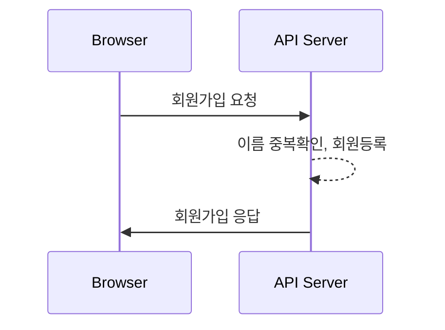
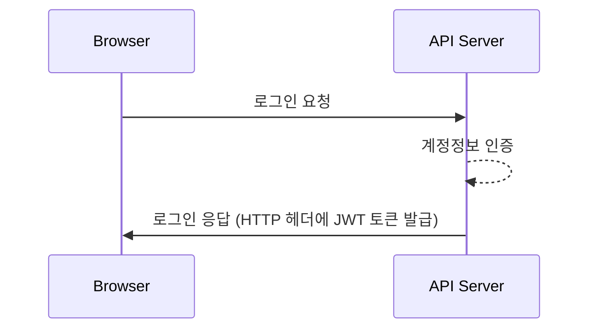
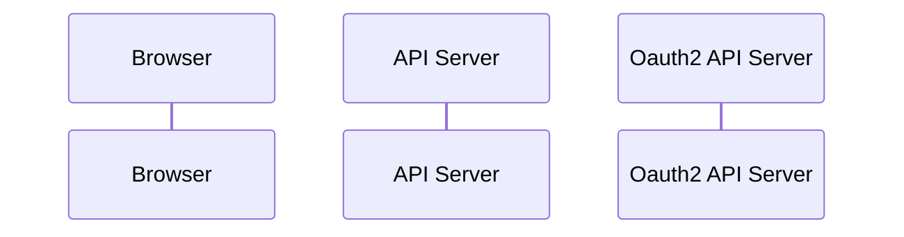
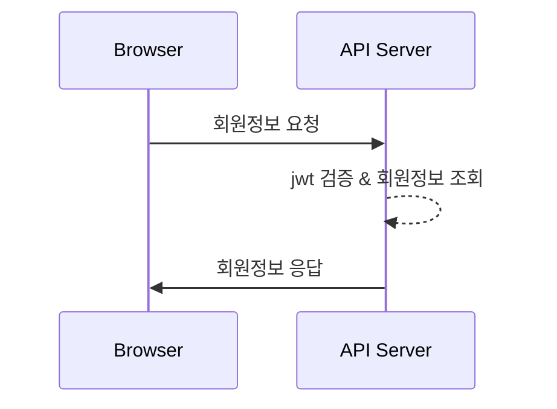

# 🔐 auth-tutorial
웹 브라우저에서 인증/인가 방식 학습을 위한 튜토리얼 코드입니다.

<br>

### 사용 기술

 <br>


 <br>


<br><br>

## 🚀 Sequence Diagram

### ```회원가입```

<br>

### ```로그인```


<br>

### ```OAuth 2.0 로그인```


<br>

### ```회원정보 조회```



<br><br>

## 🌁 Browser Client

### Login Page
- 로그인 요청
- 회원가입 페이지 이동

### Join Page
- 회원가입 요청

### Main Page
- 로그아웃 요청
- 회원정보 요청


<br><br>

## 📄 Backend API


| 기능 | Method | URL | 
|---|---|---|
| 회원가입 | POST | /api/v1/users |
| 로그인 | POST | /api/v1/auth/login |
| 로그아웃 | POST | /api/v1/auth/logout |
| 본인 아이디 조회 | GET | /api/v1/auth/whoami |
| 회원정보 요청 | GET | /api/v1/users/{userId} |

<br>

**회원가입 - [POST] ```/api/v1/users```**
- 요청<br>
  ```json
  HTTP Body
  {
    "name" : string,
    "password" : string
  }
  ```
- 응답<br>
  ```json
  HTTP Body
  {
    "status": 201,
    "message": "Join completed.",
    "data": null,
    "timestamp": "yyyy-mm-ddThh:mm:ssZ"
  }
  ```
  ```json
  HTTP Body
  {
    "status": 400,
    "message": "Invalid value",
    "data": null,
    "timestamp": "yyyy-mm-ddThh:mm:ssZ"
  }
  ```
  ```json
  HTTP Body
  {
    "status": 409,
    "message": "Duplicated name",
    "data": null,
    "timestamp": "yyyy-mm-ddThh:mm:ssZ"
  }
  ```
  ```json
  HTTP Body
  {
    "status": 500,
    "message": "Server error",
    "data": null,
    "timestamp": "yyyy-mm-ddThh:mm:ssZ"
  }
  ```

<br>

**로그인 - [POST] ```/api/v1/auth/login```**
- 요청
  ```json
  HTTP Body
  {
    "name" : string,
    "password" : string
  }
  ```
- 응답
  ```json
  HTTP Header
  "Authorization": "Bearer {JWT}"

  HTTP Body
  {
    "status": 200,
    "message": "Login completed successfully.",
    "data": null,
    "timestamp": "yyyy-mm-ddThh:mm:ssZ"
  }
  ```
  ```json
  HTTP Body
  {
    "status": 401,
    "message": "Authentication failed.",
    "data": null,
    "timestamp": "yyyy-mm-ddThh:mm:ssZ"
  }
  ```
  ```json
  HTTP Body
  {
    "status": 500,
    "message": "Server error",
    "data": null,
    "timestamp": "yyyy-mm-ddThh:mm:ssZ"
  }
  ```

<br>

**로그아웃 - [POST] ```/api/v1/auth/logout```**
- 요청<br>
  ```json
  HTTP Header
  "Authorization": "Bearer {JWT}"
  ```
- 응답
  ```json
  HTTP Body
  {
    "status": 200,
    "message": "Logout completed successfully",
    "data": null,
    "timestamp": "yyyy-mm-ddThh:mm:ssZ"
  }
  ```
  ```json
  HTTP Body
  {
    "status": 401,
    "message": "Authentication failed",
    "data": null,
    "timestamp": "yyyy-mm-ddThh:mm:ssZ"
  }
  ```
  ```json
  HTTP Body
  {
    "status": 500,
    "message": "Server error",
    "data": null,
    "timestamp": "yyyy-mm-ddThh:mm:ssZ"
  }
  ```

<br>

**본인 아이디 조회 - [GET] ```/api/v1/auth/whoami```**
- 요청
  ```json
  HTTP Header
  "Authorization": "Bearer {JWT}"
  ```
- 응답
  ```json
  {
    "status": 200,
    "message": "OK",
    "data": {
      "id": number
    },
    "timestamp": "yyyy-mm-ddThh:mm:ssZ"
  } 
  ```
  ```json
  {
    "status": 401,
    "message": "Authentication failed.",
    "data": null,
    "timestamp": "yyyy-mm-ddThh:mm:ssZ"
  } 
  ```
  ```json
  {
    "status": 500,
    "message": "Server error",
    "data": null,
    "timestamp": "yyyy-mm-ddThh:mm:ssZ"
  } 
  ```

<br>

**회원정보 조회 - [GET] ```/api/v1/users/{userId}```**
- 요청
  ```json
  HTTP Header
  "Authorization": "Bearer {JWT}"
  ```
- 응답
  ```json
  {
    "status": 200,
    "message": "OK",
    "data": {
      "id": number,
      "name": string
    },
    "timestamp": "yyyy-mm-ddThh:mm:ssZ"
  } 
  ```
  ```json
  {
    "status": 401,
    "message": "Authentication failed.",
    "data": null,
    "timestamp": "yyyy-mm-ddThh:mm:ssZ"
  } 
  ```
  ```json
  {
    "status": 404,
    "message": "User with [id] not found.",
    "data": null,
    "timestamp": "yyyy-mm-ddThh:mm:ssZ"
  } 
  ```
  ```json
  {
    "status": 500,
    "message": "Server error",
    "data": null,
    "timestamp": "yyyy-mm-ddThh:mm:ssZ"
  } 
  ```